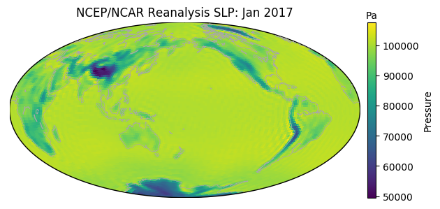

# pyingrid: python interface to the Columbia University IRI data library

## Example

    from pyingrid import Ingrid
    import xarray as xr
    import matplotlib.pyplot as plt
  
    
    da = Ingrid('ps_ncep').do('T(Jan 2017)VALUE').to_xarray()
    da.sel(T='2017-01-01').geo.geoplot()
    plt.title('NCEP/NCAR Reanalysis SLP: Jan 2017')

